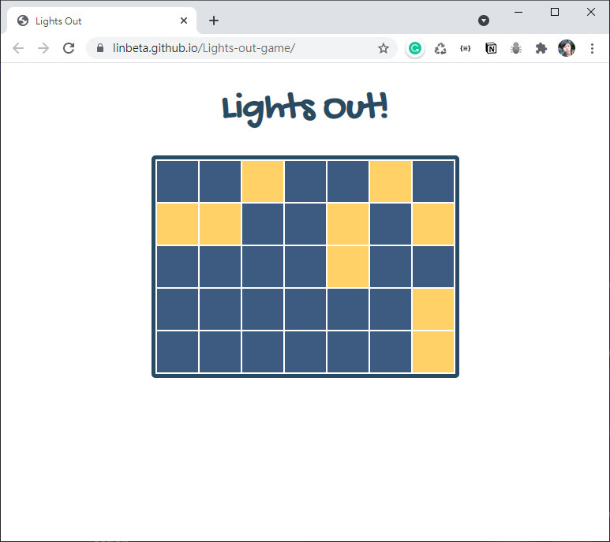

# Building First JS Game: Lights Out

This project is base on the [Rithm School](https://www.rithmschool.com/) Webinar on 15th July 2021.

The [step-by-step instruction page](https://rithm-students-assets.s3.amazonaws.com/meetups/lectures/first-game-lights-out/handout/index.html) is well documented. I enjoyed this online session a lot, the instructor Joel Burton's teaching style is clear and easy to understand. He's good at making examples and he also teaches the structure of solving problems and how to break down coding ideas into small pieces and tackle them step by step.

The webinar is on zoom and there were only 13 attendees including me. We were encouraged to ask questions. I learnt a lot from this.

# About this branch

The JavaScript part in this branch is mainly from the webinar and the instruction page. I only added some CSS designs to create my version after the session.

### [Play Lights-Out](https://linbeta.github.io/Lights-out-game/)
game link: https://linbeta.github.io/Lights-out-game/

# My developing plan

In the following 2 weeks, I plan to rewrite my version from scratch and will add some features to challenge myself to make sure I understand every part of the code. It will be really good practice for me to implement everything I learnt about JavaScript!
